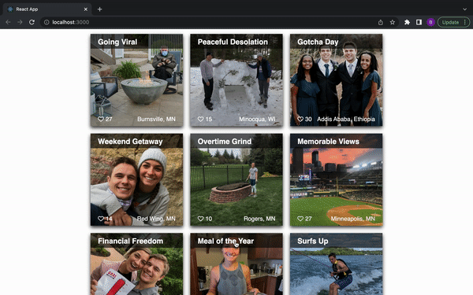

# Image Gallery

## Description

Welcome to my highlight of 2021! The scope of this project was to create a dynamic photo gallery that allowed users to toggle between an image and its description. There is also a "like" feature will increase the like count when the heart is clicked. 

### Instructions 
Click on an image to learn more about a photo. If you deem a photo worthy of your satisfaction, click the heart icon on the bottom left of the screen! 

### Duration 

The total duration of the project was roughly ~16 hours. 

### What problem was solved? 

After ensuring the application was functioning the way it should, a majority of my time was spent organizing all elements to match the wireframe I sketched out at the start of the project. CSS was very challenging for this project, which solidified my understanding of positioning as a result.

Below are a few steps I took to ensure project satisfaction: 

- Plan out objectives pertaining to the project and create a list of to-dos reflecting each objective
- Set up all necessary endpoints on client side and test connection with server using POSTMAN
- Set up React components and use PROPS to transfer data located in the App.jsx file to their respective children
- Transfer all server data to database and reconfigure endpoints on server to accommodate for the database
- Stylize rendered elements to reflect initial wireframe

## Wireframe

### Built with:
- React
- CSS3 
- Node.js
- postgreSQL   

### Acknowledgement

This project is implemented into the curriculum taught at Prime Academy to strengthen our understanding of react as it relates to the fullstack.